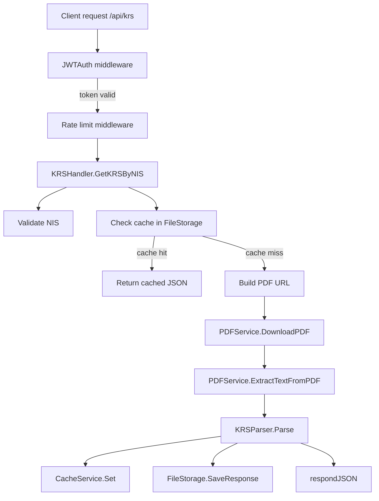

# Documentation-v1

## 1. Tujuan Dokumentasi
Dokumentasi ini menjadi panduan testing backend untuk endpoint KRS pada project `be-lonceng_unman`, mulai dari penerimaan identitas mahasiswa melalui JWT claim NIS/NPM, pemanggilan endpoint PDF LMS, ekstraksi PDF raw, parsing teks, penyimpanan cache dan file, sampai pembentukan response JSON.

Dokumen ini juga mencakup audit struktur project yang relevan, daftar test case, dependency yang dibutuhkan, strategi validasi, serta format output yang wajib diverifikasi.

## 2. Scope Audit Project
Audit dilakukan pada alur berikut:

1. Request masuk ke route protected `/api/krs`.
2. JWT middleware memvalidasi token dan mengekstrak claim `npm`.
3. Handler `GetKRSByNIS` memvalidasi nilai NIS/NPM dari context.
4. Handler membangun PDF URL dari `PDF_BASE_URL` dan parameter `nis`.
5. `PDFService.DownloadPDF` mengunduh PDF dari LMS eksternal.
6. `PDFService.ExtractTextFromPDF` mengekstrak raw text dari PDF.
7. `KRSParser.Parse` membentuk `KRSResponse` dari teks PDF.
8. `CacheService` dan `FileStorage` menyimpan hasil response.
9. Response JSON dikirim dengan format sukses atau error.

## 3. Hasil Audit Struktur Project

### 3.1 File utama yang dianalisis
- [`cmd/api/main.go`](../cmd/api/main.go:1)
- [`internal/routes/routes.go`](../internal/routes/routes.go:1)
- [`internal/handler/krs_handler.go`](../internal/handler/krs_handler.go:1)
- [`internal/services/pdf_service.go`](../internal/services/pdf_service.go:1)
- [`internal/model/krs_model.go`](../internal/model/krs_model.go:1)
- [`internal/storage/file_storage.go`](../internal/storage/file_storage.go:1)
- [`internal/middleware/jwt_auth.go`](../internal/middleware/jwt_auth.go:1)
- [`internal/middleware/rate_limit.go`](../internal/middleware/rate_limit.go:1)
- [`internal/config/env.go`](../internal/config/env.go:1)
- [`internal/config/output.go`](../internal/config/output.go:1)
- [`internal/model/error_codes.go`](../internal/model/error_codes.go:1)
- [`internal/services/krs_service_test.go`](../internal/services/krs_service_test.go:1)
- [`internal/services/pdf_integration_test.go`](../internal/services/pdf_integration_test.go:1)
- [`internal/services/pdf_debug_test.go`](../internal/services/pdf_debug_test.go:1)

### 3.2 Temuan teknis utama
- Endpoint KRS berada di route protected `/api/krs`, bukan public.
- Identitas mahasiswa diambil dari JWT claim `npm` yang disimpan ke context key `user_npm`.
- NIS valid harus 10 digit numerik melalui [`ValidateNIS`](../internal/services/pdf_service.go:145).
- PDF base URL default mengarah ke domain LMS universitas, dapat dioverride lewat `PDF_BASE_URL`.
- Response sukses dibungkus menggunakan [`SuccessResponse`](../internal/model/response_wrapper.go:18).
- Error response dibentuk menggunakan [`ErrorResponse`](../internal/model/error_response.go:3) dan error code dari [`error_codes.go`](../internal/model/error_codes.go:4).
- File cache disimpan pada struktur `storage/raw`, `storage/response`, dan `storage/extracted`.
- Ada test existing untuk parser, cache, dan integrasi PDF, tetapi cakupan error matrix belum lengkap.

## 4. Endpoint Flow Yang Wajib Diuji

## 5. Test Strategy

### 5.1 Jenis pengujian
1. Unit test
2. Integration test
3. Endpoint test
4. Contract test response JSON
5. Cache behavior test
6. File storage test
7. Error mapping test
8. Network dependency test untuk PDF download

### 5.2 Fokus pengujian
- Validasi input dan auth
- Download PDF dari LMS
- Ekstraksi raw PDF
- Parsing teks PDF menjadi struktur KRS
- Penanganan cache hit/miss/expired
- Penyimpanan file output
- Konsistensi response sukses dan error
- Semua error path yang dipetakan ke HTTP status dan error code

## 6. Test Matrix

### 6.1 Unit Test Matrix

#### A. [`ValidateNIS`](../internal/services/pdf_service.go:145)
- NIS valid: `2211700006`
- NIS kosong
- NIS 9 digit
- NIS 11 digit
- NIS berisi alfabet
- NIS berisi simbol

#### B. [`PDFService.DownloadPDF`](../internal/services/pdf_service.go:33)
- URL valid HTTPS dan domain valid
- URL non-HTTPS
- URL domain invalid
- HTTP status bukan 200
- Content-Type bukan PDF
- PDF terlalu kecil
- PDF tanpa magic bytes `%PDF-`
- Context timeout
- Network error

#### C. [`PDFService.ExtractTextFromPDF`](../internal/services/pdf_service.go:85)
- PDF bytes valid dengan teks
- PDF bytes kosong
- PDF rusak / tidak bisa dibaca
- PDF valid tapi tidak menghasilkan teks
- Error per page saat ekstraksi

#### D. [`KRSParser.Parse`](../internal/model/krs_model.go:51)
- Teks lengkap valid
- Teks kosong
- Data mahasiswa tidak lengkap
- Info akademik tidak lengkap
- Tabel mata kuliah tidak ditemukan
- Mata kuliah kosong
- SKS tidak valid
- Format line-by-line sesuai PDF aktual

#### E. [`KRSHandler.mapErrorToHTTPStatus`](../internal/handler/krs_handler.go:168)
- Deadline exceeded
- 404 / not found
- invalid URL / invalid domain
- PDF terlalu kecil / missing header
- external service unavailable
- data mahasiswa kosong
- daftar mata kuliah kosong
- text content kosong
- default internal server error

#### F. [`FileStorage`](../internal/storage/file_storage.go:21)
- Simpan PDF
- Simpan response JSON
- Simpan extracted text
- Ambil cache response yang masih valid
- Ambil cache PDF yang masih valid
- Cache expired
- Cleanup expired files
- Hitung umur cache

#### G. [`CacheService`](../internal/services/cache_service.go:14)
- Set dan Get berhasil
- Cache miss
- TTL nol atau negatif
- Data expired
- Delete data

### 6.2 Integration Test Matrix

#### A. `ProcessKRSFromURL`
- Alur lengkap dari download sampai parse berhasil
- Gagal download PDF
- Gagal ekstraksi teks
- Gagal parse teks
- PDF URL valid dengan NIS `2211700006`

#### B. Handler to storage integration
- Request valid menghasilkan cache file JSON
- Request valid menyimpan output ke storage
- Request ulang menggunakan cache bila tersedia
- Cache expired memaksa proses ulang

#### C. Endpoint integration
- `/api/krs` dengan JWT valid dan claim `npm=2211700006`
- `/api/krs` tanpa token
- `/api/krs` token format salah
- `/api/krs` token expired
- `/api/krs` claim `npm` kosong
- `/api/krs` NIS invalid
- `/api/krs` response error dari upstream PDF

### 6.3 Contract Test Matrix

#### Success contract
- `status = success`
- `data` berisi object KRS
- `meta.timestamp` terisi
- `meta.version = 1.0.0`
- `meta.cached` sesuai sumber data
- `Cache-Control` ada untuk status 200

#### Error contract
- `status = error`
- `code` sesuai error mapping
- `message` sesuai kasus
- `details` tersedia dan konsisten
- `timestamp` terisi

## 7. Data Setup Requirements

### 7.1 Parameter utama
- NIS sample: `2211700006`
- JWT claim yang harus diuji: `npm=2211700006`
- PDF base URL default: `https://elearning.universitasmandiri.ac.id/admin/cetak/krs_pdf.php`

### 7.2 Environment variable yang perlu divalidasi
- `JWT_SECRET`
- `RUNNING_PORT`
- `PDF_BASE_URL`
- `RATE_LIMIT_RPS`
- `RATE_LIMIT_BURST`
- `OUTPUT_DIR`
- `API_KEY`
- `SERVER_VERSION`

### 7.3 Fixture dan artefak test
- Sample PDF valid untuk `2211700006`
- Sample PDF rusak
- Sample PDF HTML error page
- Sample extracted text valid
- Cached JSON response valid
- Cached response expired
- Cached PDF expired
- Expected file output di `storage/raw`, `storage/response`, dan `storage/extracted`

### 7.4 Strategi dependency network
- Untuk unit test: mock atau stub service, tidak bergantung ke jaringan
- Untuk integration test: gunakan real endpoint hanya jika environment mengizinkan
- Jika endpoint eksternal tidak stabil, fallback ke fixture lokal
- Gunakan timeout eksplisit di context
- Uji perilaku timeout dan error upstream secara terpisah

## 8. Expected Assertions

### 8.1 Jalur sukses
Untuk request sukses dengan NIS `2211700006`:
- HTTP status `200 OK`
- Response JSON sesuai [`SuccessResponse`](../internal/model/response_wrapper.go:18)
- `status` bernilai `success`
- `data.mahasiswa.npm` sama dengan `2211700006`
- `data.mahasiswa.nama` tidak kosong
- `data.mahasiswa.program_studi` tidak kosong
- `data.tahun_ajaran` valid
- `data.semester` valid
- `data.mata_kuliah` tidak kosong
- `data.total_sks` sama dengan total SKS hasil parsing
- `meta.cached` `false` untuk request pertama dan `true` untuk cache hit
- File JSON tersimpan di `storage/response`
- PDF raw tersimpan di `storage/raw` bila test path menyimpannya
- Teks ekstraksi tersimpan di `storage/extracted` bila test path menyimpannya

### 8.2 Jalur error
Setiap error harus diverifikasi pada:
- HTTP status
- `code`
- `message`
- `details`
- timestamp
- tidak ada side effect file jika proses gagal sebelum tahap penyimpanan

#### Error yang wajib diuji
- Unauthorized karena JWT header hilang
- Unauthorized karena JWT invalid
- Unauthorized karena JWT expired
- Unauthorized karena claim `npm` hilang
- Bad request karena NIS invalid
- Not found karena data mahasiswa tidak lengkap
- Not found karena daftar mata kuliah kosong
- Bad gateway karena PDF content bukan PDF
- Bad gateway karena PDF file terlalu kecil
- Service unavailable karena upstream error
- Gateway timeout karena context deadline exceeded
- Internal server error karena gagal parse text
- Internal server error karena gagal encode JSON
- Internal server error karena cache/storage error bila dipropagasi dari layer terkait

### 8.3 Side effects yang harus diperiksa
- Cache JSON dibuat hanya saat success path
- File response tidak dibuat saat validasi gagal
- File raw PDF tidak ditulis ulang pada cache hit
- File expired dihapus saat `GetCachedResponse` atau `CleanupExpired`
- Response JSON tetap konsisten walau storage gagal, selama handler memutuskan failure tersebut non-kritis

## 9. Rencana Test Case Detail

### 9.1 Happy path utama
1. Kirim request ke `/api/krs`.
2. Sertakan JWT valid dengan claim `npm=2211700006`.
3. Pastikan cache kosong untuk NIS tersebut.
4. Pastikan request memanggil upstream PDF.
5. Pastikan PDF berhasil diunduh.
6. Pastikan text berhasil diekstrak.
7. Pastikan parser menghasilkan KRS valid.
8. Pastikan response 200 dan file response tersimpan.

### 9.2 Cache hit path
1. Jalankan request sukses pertama.
2. Simpan response ke storage.
3. Jalankan request kedua dengan NIS sama.
4. Verifikasi handler membaca cache dari `storage/response`.
5. Pastikan response tetap valid dan `meta.cached = true`.

### 9.3 Error path berurutan
1. JWT missing.
2. JWT malformed.
3. JWT expired.
4. NPM claim kosong.
5. NIS invalid format.
6. Upstream PDF 404.
7. Upstream PDF bukan PDF.
8. Upstream PDF terlalu kecil.
9. PDF bytes valid tapi parser gagal.
10. Data mahasiswa tidak lengkap.
11. Mata kuliah kosong.
12. Context timeout.

## 10. Acceptance Criteria
Dokumentasi dan test plan dianggap selesai bila:
- Audit struktur project sudah mencakup semua komponen utama endpoint KRS.
- Semua jalur success dan error dari auth sampai response JSON terdokumentasi.
- Test matrix mencakup unit, integration, endpoint, contract, cache, dan storage.
- Skenario dengan sample NIS `2211700006` terdefinisi jelas.
- Semua environment variable dan fixture kebutuhan test tercantum.
- Side effect file storage telah dirinci.
- Dokumen disimpan dalam folder [`plans`](../plans:1) sebagai file markdown.
- Dokumentasi siap dipakai sebagai acuan implementasi testing lanjutan.

## 11. Rekomendasi Implementasi Testing Berikutnya
Setelah plan ini disetujui, tahap implementasi idealnya dilakukan dalam urutan:
1. Tambahkan atau rapikan unit test parser dan service.
2. Tambahkan endpoint test untuk `/api/krs` menggunakan request JWT mock.
3. Tambahkan test untuk cache hit/miss dan file storage.
4. Tambahkan contract assertion untuk success dan error response.
5. Jalankan `go test ./...` dan catat hasilnya.
6. Sinkronkan hasil test aktual ke dokumentasi final `Documentation-v1.md`.

## 12. Catatan Audit Khusus
- Endpoint `GetKRSByNIS` pada [`internal/handler/krs_handler.go`](../internal/handler/krs_handler.go:37) membaca NIS dari context, jadi test endpoint harus mempersiapkan JWT middleware atau mock context secara eksplisit.
- Error mapping di [`mapErrorToHTTPStatus`](../internal/handler/krs_handler.go:168) berbasis string matching, sehingga test error harus memverifikasi teks error upstream secara ketat.
- Kode existing masih memiliki beberapa `WriteFile` yang tidak memeriksa error pada test helper; untuk dokumentasi testing, hasilnya tetap harus dianggap artefak yang perlu diverifikasi.
- Penyimpanan cache file dan JSON response menggunakan filesystem, sehingga test perlu mengontrol direktori output agar tidak bercampur dengan artefak manual.

## 13. Output Dokumen Yang Diinginkan
Hasil akhir yang diharapkan dari tahap dokumentasi ini adalah:
- satu file markdown plan lengkap,
- bisa dibaca sebagai panduan testing end-to-end,
- berisi checklist eksekusi,
- siap dipakai untuk mode implementasi testing berikutnya,
- dan dapat diperluas menjadi dokumentasi final di root project bila diperlukan.
