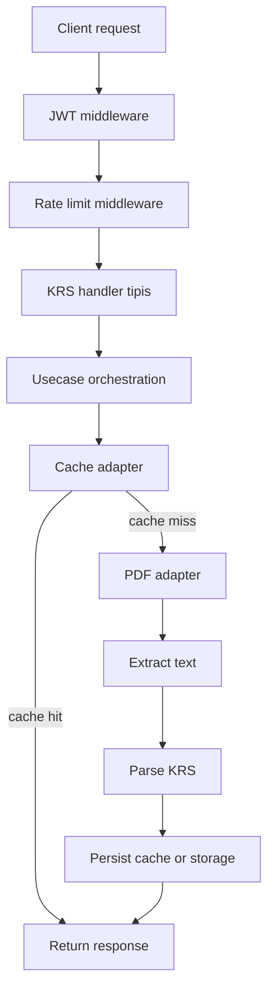

# Production Readiness Remediation Plan for `be-lonceng_unman`

## 1. Tujuan
Dokumen ini adalah plan remediasi terstruktur untuk membawa backend Go ini dari status prototype single-node menuju layanan yang lebih aman untuk production dan lebih siap untuk scaling horizontal.

Fokus plan:
- menghilangkan hardcode yang menghambat multi-environment deployment,
- memperbaiki bug dan risiko security yang berdampak langsung ke produksi,
- memisahkan boundary arsitektur yang masih bercampur,
- mengurangi ketergantungan pada filesystem lokal sebagai source of truth,
- membersihkan repository agar siap CI/CD dan deployment container.

Dokumen ini bukan implementasi. Ini adalah blueprint eksekusi yang bisa dipakai mode Code untuk refactor bertahap.

---

## 2. Ringkasan Audit

### 2.1 Kondisi yang sudah baik
- Entry point terpisah di [`cmd/api/main.go`](../cmd/api/main.go:22).
- Ada pemisahan folder dasar: [`internal/handler`](../internal/handler/krs_handler.go:20), [`internal/services`](../internal/services/pdf_service.go:20), [`internal/middleware`](../internal/middleware/rate_limit.go:12), [`internal/storage`](../internal/storage/file_storage.go:11).
- Sudah ada timeout server dan graceful shutdown di [`cmd/api/main.go`](../cmd/api/main.go:61) dan [`cmd/api/main.go`](../cmd/api/main.go:79).
- Logging sudah memakai [`slog`](../cmd/api/main.go:27).
- Request KRS sudah divalidasi melalui [`ValidateNIS()`](../internal/services/pdf_service.go:190).
- JWT dan API key sudah ada sebagai layer keamanan awal.

### 2.2 Masalah utama
- Banyak nilai operasional masih hardcoded.
- Ada package-level env read yang rawan init-order bug.
- Response helper berpotensi salah urutan penulisan header.
- Validasi domain PDF masih terlalu keras-coding dan belum sepenuhnya config-driven.
- Rate limit masih berbasis local state dan belum proxy-aware.
- Parser dan orchestration masih bercampur di layer model dan handler.
- Filesystem lokal masih dipakai sebagai cache dan persistensi utama.
- Repository masih tercemar artefak runtime dan backup file.

---

## 3. Sasaran Remediasi

### 3.1 Sasaran fungsional
1. Response sukses dan error konsisten.
2. Validasi input, auth, dan URL eksternal lebih aman.
3. Config terpusat dan bisa diubah per environment tanpa rebuild.
4. Cache dan storage bisa dipindahkan dari filesystem lokal ke adapter yang lebih aman.
5. Parser dan business logic tidak lagi bercampur dengan entity model.
6. Repository bersih dari artefak runtime.

### 3.2 Sasaran non-fungsional
1. Lebih mudah di-deploy ke container dan Kubernetes.
2. Lebih mudah dites secara unit dan integration.
3. Lebih aman untuk scaling horizontal.
4. Lebih mudah dirawat oleh tim.
5. Lebih mudah diobservasi saat terjadi incident.

---

## 4. Diagnosis Arsitektur Saat Ini

### 4.1 Struktur folder yang ada
- `cmd/api`: bootstrap aplikasi.
- `internal/config`: load env dan output directory.
- `internal/handler`: HTTP handler.
- `internal/middleware`: auth, API key, rate limit.
- `internal/model`: DTO, response, parser, error code.
- `internal/services`: PDF processing dan cache in-memory.
- `internal/storage`: file-based persistence.
- `internal/routes`: route wiring.

### 4.2 Smell utama
#### A. Handler terlalu tebal
[`KRSHandler`](../internal/handler/krs_handler.go:20) mengerjakan banyak concern sekaligus:
- ambil auth claim,
- validasi NIS,
- cek cache,
- bangun PDF URL,
- proses PDF,
- validasi hasil parse,
- simpan cache,
- simpan file storage,
- mapping error,
- kirim response.

Ini membuat handler sulit diuji dan sulit dipindahkan ke arsitektur yang lebih besar.

#### B. Config tersebar
Nilai operasional masih tersebar di beberapa tempat:
- port di [`cmd/api/main.go`](../cmd/api/main.go:30),
- default PDF URL di [`internal/config/env.go`](../internal/config/env.go:47),
- default rate limit di [`internal/config/env.go`](../internal/config/env.go:55),
- version fallback di response helper,
- output directory di [`internal/config/output.go`](../internal/config/output.go:33).

#### C. Runtime state lokal
- [`CacheService`](../internal/services/cache_service.go:18) menyimpan cache di memory process.
- [`RateLimit`](../internal/middleware/rate_limit.go:12) menyimpan visitor di memory process.
- [`FileStorage`](../internal/storage/file_storage.go:11) menulis ke disk lokal.

Ini cukup untuk single instance, tapi tidak ideal untuk replica atau autoscaling.

#### D. Parser bercampur dengan model
Dokumen audit dan plan ini mengindikasikan parser dan extraction logic masih bercampur dengan entity layer. Itu membuat model sulit dipakai ulang dan melanggar clean boundary.

#### E. Artefak repo masih kotor
Ada output runtime, binary build, backup file, dan file debug/test yang tidak seharusnya menjadi source of truth.

---

## 5. Target Struktur yang Lebih Sehat

Target akhir tidak harus dicapai sekaligus, tetapi arah desainnya sebaiknya seperti ini:

```text
cmd/
  api/
    main.go

internal/
  config/
  domain/
    krs/
  usecase/
    krs/
  transport/
    http/
      handler/
      middleware/
  infra/
    pdf/
    storage/
  model/
  routes/
```

### 5.1 Makna struktur target
- `cmd/api`: hanya bootstrap aplikasi.
- `internal/config`: satu pintu config loader dan typed config.
- `internal/domain/krs`: entity, value object, dan interface domain.
- `internal/usecase/krs`: orchestration parsing dan business flow.
- `internal/transport/http/handler`: HTTP layer tipis.
- `internal/transport/http/middleware`: auth, rate limit, logging.
- `internal/infra/pdf`: implementasi download dan extraction PDF.
- `internal/infra/storage`: adapter filesystem, object storage, cache, atau Redis.
- `internal/model`: DTO dan response shape bila masih dibutuhkan.

### 5.2 Jika belum siap migrasi total
Minimal lakukan langkah bertahap berikut:
1. pindahkan parser keluar dari [`internal/model/krs_model.go`](../internal/model/krs_model.go:1),
2. jadikan [`internal/storage/file_storage.go`](../internal/storage/file_storage.go:1) sebagai adapter, bukan source of truth,
3. tipiskan [`internal/handler/krs_handler.go`](../internal/handler/krs_handler.go:1),
4. pusatkan config di [`internal/config/env.go`](../internal/config/env.go:1).

---

## 6. Target Architecture Flow



---

## 7. Prioritas Perbaikan

## P0 - Stabilitas produksi dan security dasar
Prioritas ini harus dikerjakan paling awal karena dampaknya paling tinggi.

### 7.1 Perbaiki response envelope
**Lokasi utama:**
- [`internal/handler/krs_handler.go`](../internal/handler/krs_handler.go:193)
- [`internal/handler/krs_handler.go`](../internal/handler/krs_handler.go:227)
- [`internal/handler/cek_response.go`](../internal/handler/cek_response.go:11)

**Masalah:**
- header bisa ditulis setelah [`WriteHeader()`](../internal/handler/krs_handler.go:196), sehingga tidak terkirim dengan benar,
- helper sukses dan error belum dipisah dengan tegas,
- kemungkinan envelope response tidak konsisten.

**Target perbaikan:**
- set semua header sebelum [`WriteHeader()`](../internal/handler/krs_handler.go:196),
- pisahkan helper response sukses dan error,
- pastikan `status = error` selalu dipakai untuk error response,
- standar response envelope satu bentuk untuk seluruh endpoint.

**Acceptance criteria:**
- `Cache-Control` terkirim di response 200,
- error response tidak pernah memakai envelope sukses,
- unit test meng-cover success, error, dan invalid JSON encoding path.

### 7.2 Hapus package-level env read di middleware API key
**Lokasi utama:**
- [`internal/middleware/api_key.go`](../internal/middleware/api_key.go:1)
- [`internal/config/env.go`](../internal/config/env.go:11)

**Masalah:**
- env dibaca terlalu awal saat init package,
- `.env` dimuat belakangan di [`LoadEnv()`](../internal/config/env.go:11),
- middleware bisa memegang nilai kosong walaupun env sebenarnya ada.

**Target perbaikan:**
- inject API key melalui config struct,
- validasi env wajib saat startup,
- hindari global mutable state untuk secret.

**Acceptance criteria:**
- middleware membaca nilai API key dari dependency injection,
- tidak ada package-level secret state,
- aplikasi fail-fast bila env wajib kosong.

### 7.3 Ganti validasi URL PDF yang lemah
**Lokasi utama:**
- [`internal/services/pdf_service.go`](../internal/services/pdf_service.go:72)

**Masalah:**
- validasi URL harus lebih eksplisit,
- host allowlist masih hardcoded,
- URL validation belum sepenuhnya config-driven.

**Target perbaikan:**
- parse URL dengan `net/url`,
- validasi schema `https`,
- validasi hostname exact match,
- pindahkan allowlist host ke config,
- jika diperlukan, tambahkan validasi path.

**Acceptance criteria:**
- URL invalid tertolak sebelum request dibuat,
- host yang tidak diizinkan tidak bisa diproses,
- test menutupi HTTPS, host mismatch, dan format URL rusak.

### 7.4 Ganti context key string menjadi typed key
**Lokasi utama:**
- [`internal/middleware/jwt_auth.go`](../internal/middleware/jwt_auth.go:105)
- [`internal/middleware/jwt_context_key.go`](../internal/middleware/jwt_context_key.go:5)
- [`internal/handler/krs_handler.go`](../internal/handler/krs_handler.go:44)

**Masalah:**
- context key string rentan collision,
- naming belum idiomatic untuk boundary context.

**Target perbaikan:**
- gunakan typed key private,
- gunakan helper yang jelas untuk set dan get context value,
- hindari string literal di lebih dari satu tempat.

**Acceptance criteria:**
- context value di-set dan diambil melalui helper typed,
- tidak ada direct usage string key di handler.

### 7.5 Hilangkan filesystem lokal sebagai cache utama
**Lokasi utama:**
- [`internal/storage/file_storage.go`](../internal/storage/file_storage.go:11)

**Masalah:**
- cache berbasis disk lokal tidak sinkron antar replica,
- data hilang saat container restart,
- tidak cocok untuk autoscaling.

**Target perbaikan:**
- definisikan interface storage adapter,
- siapkan implementasi untuk Redis atau shared storage,
- jadikan local disk hanya fallback sementara bila memang masih dibutuhkan.

**Acceptance criteria:**
- handler tidak bergantung langsung pada path lokal,
- storage bisa diganti tanpa ubah handler,
- cache invalidation bisa diuji tanpa file system dependency.

---

## P1 - Arsitektur, maintainability, dan operasional

### 7.6 Pusatkan config menjadi typed config tunggal
**Lokasi utama:**
- [`internal/config/env.go`](../internal/config/env.go:1)
- [`internal/config/output.go`](../internal/config/output.go:1)
- [`cmd/api/main.go`](../cmd/api/main.go:30)
- [`internal/services/pdf_service.go`](../internal/services/pdf_service.go:24)
- [`internal/middleware/rate_limit.go`](../internal/middleware/rate_limit.go:70)

**Masalah:**
- port, version, timeout, TTL, cache config, dan URL masih tersebar,
- beberapa nilai masih diambil langsung dari `os.Getenv` di banyak tempat.

**Target perbaikan:**
- buat satu `Config` struct,
- kelompokkan env: server, pdf, security, rate limit, storage,
- semua nilai operasional dapat dioverride dari environment,
- validasi env wajib saat startup.

**Acceptance criteria:**
- aplikasi punya satu sumber config,
- tidak ada `os.Getenv` tersebar di handler/service kecuali benar-benar diperlukan,
- config default jelas dan terdokumentasi.

### 7.7 Pisahkan parser dari model
**Lokasi utama:**
- [`internal/model/krs_model.go`](../internal/model/krs_model.go:1)

**Masalah:**
- model memuat parser, extraction logic, dan business rules,
- boundary domain menjadi kabur.

**Target perbaikan:**
- model hanya entity atau DTO,
- parsing logic pindah ke service atau usecase,
- bila perlu tambah package parser khusus.

**Acceptance criteria:**
- model tidak lagi bergantung pada logic parsing,
- parser punya unit test sendiri,
- entity dan parser bisa berubah terpisah.

### 7.8 Perbaiki rate limit agar proxy-aware dan lifecycle-safe
**Lokasi utama:**
- [`internal/middleware/rate_limit.go`](../internal/middleware/rate_limit.go:12)
- [`internal/middleware/rate_limit.go`](../internal/middleware/rate_limit.go:55)
- [`internal/middleware/rate_limit.go`](../internal/middleware/rate_limit.go:70)

**Masalah:**
- client IP diambil dari [`r.RemoteAddr`](../internal/middleware/rate_limit.go:58),
- cleanup goroutine tidak punya stop signal,
- rate limiting belum mempertimbangkan reverse proxy.

**Target perbaikan:**
- ambil IP dari `X-Forwarded-For` atau `X-Real-IP` sesuai trust policy,
- tambahkan `context` atau `done` channel untuk menghentikan cleanup,
- dokumentasikan apakah proxy dipercaya atau tidak.

**Acceptance criteria:**
- rate limit bekerja benar di belakang proxy,
- cleanup goroutine berhenti saat shutdown,
- tidak ada goroutine leak pada test atau restart.

### 7.9 Jadikan version dan service metadata env-driven
**Lokasi utama:**
- [`internal/handler/krs_handler.go`](../internal/handler/krs_handler.go:204)
- [`internal/handler/cek_response.go`](../internal/handler/cek_response.go:21)

**Masalah:**
- version fallback `1.0.0` masih inline,
- metadata response belum satu sumber.

**Target perbaikan:**
- tarik versi dari env atau build metadata,
- gunakan satu sumber metadata untuk response.

**Acceptance criteria:**
- response version konsisten di semua endpoint,
- build pipeline bisa menyuntikkan versi release.

### 7.10 Perbaiki error classification dan response mapping
**Lokasi utama:**
- [`internal/handler/krs_handler.go`](../internal/handler/krs_handler.go:169)
- [`internal/model/error_codes.go`](../internal/model/error_codes.go:1)

**Masalah:**
- mapping error masih berbasis string matching,
- sangat rentan berubah saat pesan error berubah.

**Target perbaikan:**
- gunakan typed error atau custom error code,
- mapping HTTP status berdasarkan code, bukan string mentah,
- standardisasi envelope error.

**Acceptance criteria:**
- HTTP status diputuskan dari error type atau code,
- test error mapping stabil walau pesan text berubah.

### 7.11 Standarkan output dan response helper
**Lokasi utama:**
- [`internal/model/response_wrapper.go`](../internal/model/response_wrapper.go:3)
- [`internal/model/error_response.go`](../internal/model/error_response.go:3)
- [`internal/handler/krs_handler.go`](../internal/handler/krs_handler.go:193)

**Masalah:**
- ada potensi duplikasi response shape,
- helper response belum sepenuhnya tersentralisasi.

**Target perbaikan:**
- pilih satu bentuk response sukses,
- pilih satu bentuk response error,
- pastikan semua endpoint mengikuti contract yang sama.

**Acceptance criteria:**
- schema response terdokumentasi,
- tidak ada dua struktur sukses yang overlap tanpa alasan.

---

## P2 - Scalability readiness dan repo hygiene

### 7.12 Bersihkan artefak backup, binary, dan runtime output
**Lokasi utama:**
- backup file di `internal/model`,
- binary build di `bin/`,
- output runtime di `output/`,
- runtime files di `storage/` atau `internal/handler/storage/response/`.

**Masalah:**
- source tree tercemar artefak non-source,
- repo lebih sulit direview,
- risiko accidental commit meningkat.

**Target perbaikan:**
- hapus backup file lama,
- keluarkan binary build dari repo,
- pindahkan output runtime ke volume atau path non-source,
- pastikan artefak tidak ikut ter-commit.

**Acceptance criteria:**
- repo hanya berisi source, doc, dan fixture yang memang diperlukan,
- runtime output diabaikan melalui `.gitignore`.

### 7.13 Tegaskan `.gitignore`
**Lokasi utama:**
- root repo

**Masalah:**
- rule ignore harus cukup tegas untuk artefak runtime dan build output.

**Target perbaikan:**
- ignore `bin/`, `output/`, runtime `storage/`, file backup, dan file hasil test yang tidak perlu di-commit,
- tetap izinkan file dokumentasi di [`plans/`](../plans).

**Acceptance criteria:**
- file runtime tidak muncul lagi di git status,
- file plan tetap bisa di-commit.

### 7.14 Evaluasi ulang dependency dan build reproducibility
**Lokasi utama:**
- [`go.mod`](../go.mod:1)

**Masalah:**
- dependency perlu diaudit agar build reproducible dan tidak ada modul tidak perlu.

**Target perbaikan:**
- audit dependency,
- hapus replace yang tidak wajib,
- rapikan versi modul.

**Acceptance criteria:**
- `go mod tidy` bersih,
- build dapat direproduksi di CI.

### 7.15 Tambahkan standar deployment production
**Lokasi utama:**
- root repo,
- Dockerfile bila ditambahkan.

**Masalah:**
- plan produksi belum lengkap tanpa standar image dan runtime security.

**Target perbaikan:**
- multi-stage build,
- non-root user,
- minimal image surface,
- env-driven config,
- health check bila relevan.

**Acceptance criteria:**
- image bisa dibuild secara repeatable,
- container tidak berjalan sebagai root,
- konfigurasi production tetap melalui env.

### 7.16 Tambahkan observability minimum
**Target:**
- request count,
- cache hit ratio,
- cache miss ratio,
- error count per code,
- upstream PDF latency,
- parse latency,
- timeout count.

**Acceptance criteria:**
- incident dapat dilacak dari log dan metrics,
- ada request identifier di log jika nanti ditambahkan.

---

## 8. Rencana Implementasi Bertahap

### Tahap 1 - Stabilkan perilaku API
Tujuan: memastikan output API tidak menipu client dan auth tidak gagal karena init order.

Urutan kerja:
1. betulkan response helper,
2. hilangkan package-level env read,
3. pindahkan version ke config,
4. perbaiki context key,
5. tambahkan test untuk success dan error envelope.

### Tahap 2 - Kunci config dan security boundary
Tujuan: menghilangkan hardcode utama dan memperketat validasi input.

Urutan kerja:
1. buat typed config tunggal,
2. validasi env wajib saat startup,
3. ganti validasi URL dengan parser URL,
4. perbaiki auth middleware,
5. audit error mapping.

### Tahap 3 - Pisahkan tanggung jawab arsitektur
Tujuan: menurunkan coupling dan membuat kode mudah dirawat.

Urutan kerja:
1. pindahkan parser keluar dari model,
2. tipiskan handler,
3. definisikan interface storage adapter,
4. susun ulang orchestration service.

### Tahap 4 - Siapkan jalur scaling horizontal
Tujuan: mengurangi ketergantungan pada local state.

Urutan kerja:
1. ubah filesystem cache menjadi adapter,
2. desain shared cache atau object storage,
3. perbaiki rate limiter agar proxy-aware,
4. tambah stop signal untuk cleanup goroutine.

### Tahap 5 - Hardening delivery dan hygiene
Tujuan: memastikan project layak CI/CD dan production deployment.

Urutan kerja:
1. bersihkan artefak repo,
2. tegaskan `.gitignore`,
3. audit dependency,
4. tambahkan Dockerfile multi-stage,
5. tambah observability minimum.

---

## 9. Test Plan yang Wajib Ada

### 9.1 Unit test
Buat unit test table-driven untuk:
- [`ValidateNIS()`](../internal/services/pdf_service.go:190),
- [`DownloadPDF()`](../internal/services/pdf_service.go:72),
- [`ExtractTextFromPDF()`](../internal/services/pdf_service.go:130),
- parser KRS,
- [`mapErrorToHTTPStatus()`](../internal/handler/krs_handler.go:169),
- cache service,
- file storage,
- JWT middleware,
- rate limit middleware.

### 9.2 Integration test
Buat integration test untuk:
- flow `ProcessKRSFromURL`,
- handler `GET /api/krs`,
- cache hit dan cache miss,
- storage write/read,
- timeout saat upstream PDF lambat,
- token invalid dan token expired.

### 9.3 Contract test
Pastikan contract response tetap konsisten:
- success response,
- error response,
- metadata version,
- cache flag,
- error code.

### 9.4 Negative test wajib
- JWT hilang,
- JWT invalid,
- claim kosong,
- NIS invalid,
- PDF URL invalid,
- upstream 404,
- PDF corrupt,
- PDF tanpa teks,
- cache write failure,
- file write failure,
- rate limit exceeded.

---

## 10. Deployment dan Operasional

### 10.1 Konfigurasi yang harus env-driven
- `RUNNING_PORT`
- `JWT_SECRET`
- `API_KEY`
- `PDF_BASE_URL`
- `RATE_LIMIT_RPS`
- `RATE_LIMIT_BURST`
- `OUTPUT_DIR`
- `SERVER_VERSION`
- timeout dan TTL bila nanti dipusatkan ke config struct

### 10.2 Standar runtime
- proses tidak boleh bergantung pada `.env` di production,
- writable path harus jelas dan terpisah dari source tree,
- container harus bisa jalan dengan user non-root,
- cleanup runtime harus aman saat shutdown.

### 10.3 Standar observability
- structured log,
- error code konsisten,
- duration per request,
- cache hit/miss,
- upstream latency,
- parse failure count.

---

## 11. Definition of Done
Remediasi dianggap selesai bila:
1. response success dan error konsisten,
2. config tidak lagi bergantung pada hardcode utama,
3. auth middleware tidak bergantung pada init-order yang rapuh,
4. handler sudah tipis dan orchestration pindah ke service/usecase,
5. cache dan rate limit punya lifecycle yang aman,
6. filesystem lokal bukan lagi source of truth,
7. repo bersih dari artefak runtime,
8. test coverage menutup jalur sukses dan jalur gagal utama,
9. deployment dapat dilakukan lewat container dan env,
10. struktur project lebih siap untuk scaling horizontal.

---

## 12. Rekomendasi Eksekusi

### Jika ingin paling aman untuk production
Kerjakan urutan berikut terlebih dahulu:
1. response helper,
2. config centralization,
3. API key init fix,
4. URL validation,
5. typed context key,
6. error mapping,
7. test coverage dasar,
8. refactor handler,
9. externalize storage dan cache,
10. deployment hardening.

### Jika ingin paling cepat menaikkan kualitas repo
Mulai dari:
1. cleanup artefak repo,
2. `.gitignore` yang ketat,
3. hardcode removal,
4. response consistency,
5. test coverage.

---

## 13. Catatan Risiko
- Perubahan storage dan cache paling berisiko karena memengaruhi alur request end-to-end.
- Refactor parser dari model ke usecase harus disertai test agar tidak merusak format output.
- Jika deployment masih single-instance dan low traffic, beberapa bagian bisa di-stabilkan dulu tanpa migrasi infrastruktur besar.

---

## 14. Kesimpulan
Project ini sudah punya fondasi yang cukup baik, tetapi saat ini masih lebih dekat ke prototype yang rapi daripada service production-grade. Fokus utama yang paling penting adalah menghilangkan hardcode, menstabilkan config dan auth init order, menipiskan handler, dan menghilangkan ketergantungan pada filesystem lokal.

Begitu langkah P0 dan P1 selesai, project ini baru layak disebut lebih siap untuk production dan scaling horizontal.
